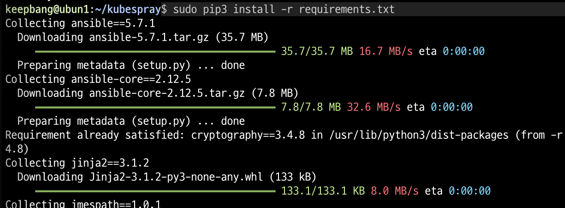
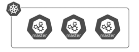

# Kubespray 설치

### kubectl alias
```
alias k=kubectl
alias ka='kubectl apply --recursive -f'
alias kcn='kubectl create deployment nginx --image=nginx'
alias kd=kubectl
alias kg=kubectl
alias kgd='kubectl get deploy -o wide'
alias kgdep=kubectl
alias kge='kubectl get event -w --field-selector type=Warning'
alias kgn='kubectl get nodes -o wide'
alias kgp='kubectl get pods -o wide'
alias kgpa='kubectl get pods -o wide -A'
alias kgpaw='kubectl get pods -o wide -A -w'
alias kgpw='kubectl get pods -o wide -w'
alias kgs='kubectl get service -o wide'
alias kgv='kubectl get pvc -o wide'
alias krb='kubectl run busybox --image=busybox --restart -- sleep 1d'
alias krn='kubectl run nginx --image=nginx --restart=Never'
alias ksys=kubectl
```

- kubespray
  - 다양한 설치 옵션 및 운영체제를 지원하는 앤서블 기반의 쿠버네티스 설치 자동화 도구.
  - 앤서블 : 애플리케이션 배포와 설정을 자동화하는 오픈소스 프로젝트
  

- 설치 옵션
  1. 컨테이너 런타임 : containerd
     - 1.20 버전부터 컨테이너 런타임으로 도커를 사용하면 경고 메시지 발생(도커 지원 종료 예정)
  2. 감사 로그 활성화
  3. MetalLB 설치를 위한 옵션 추가
  

### kubespray 받기
```shell
$ git clone https://github.com/kubernetes-sigs/kubespray.git
```

### apt update > pip 설치 > 필수 모듈 설치
- 여러가지 필수 모듈 설치를 위한 pip 설치
- `kubespray`를 `clone`받으면 `requirements.txt`파일에 필수 모듈들이 있다. 
```shell
$ sudo apt update -y
$ sudo apt install -y python3-pip
$ pip3 --version
pip 22.0.2 from /usr/lib/python3/dist-packages/pip (python 3.10)

cd kubespray/
$ cat requirements.txt
ansible==5.7.1
ansible-core==2.12.5
cryptography==3.4.8
jinja2==3.1.2
jmespath==1.0.1
MarkupSafe==2.1.2
netaddr==0.8.0
pbr==5.11.1
ruamel.yaml==0.17.21
ruamel.yaml.clib==0.2.7
$ sudo pip3 install -r requirements.txt
```



### 쿠버네티스가 설치될 노드 지정 및 설정 변경
- 클러스터가 설치될 노드 정보가 담긴 hosts 파일 생성
- 다른 서버의 호스트명과 워커 노드들을 지정함.
  ```shell
  all:
  hosts:
    ubun1:
      ansible_host: ubun1
    ubun2:
      ansible_host: ubun2
    ubun3:
      ansible_host: ubun3
  children:
    kube_control_plane:
      hosts:
        ubun1:
        ubun2:
        ubun3:
    kube_node:
      hosts:
        ubun1:
        ubun2:
        ubun3:
    etcd:
      hosts:
        ubun1:
        ubun2:
        ubun3:
    k8s_cluster:
      children:
        kube_control_plane:
        kube_node:
        calico_rr:
    calico_rr:
      hosts: {}
  ```

- 쿠버네티스 설치 관련 옵션 수정
```shell
$ vi kubespray/inventory/mycluster/group_vars/k8s_cluster/k8s-cluster.yml
...
kube_proxy_strict_arp: true
# 로드밸런서 용도로 MetalLB를 사용하기 위한 설정

container_manager: containerd # 런타임 설정(기본: containerd)

kubernetes_audit: true
# 클러스터 감사 로그 활성화
```

여기까지가 쿠버네티스 클러스터 설치를 위한 준비...

`ansible-playbook` 명령어를 사용하여 클러스터 설치

```shell
$ ansible-playbook -i inventory/mycluster/hosts.yml --become --become-user=root -v cluster.yml
```

만약 password 관련 에러가 나오면 아래 명령어로 패스워드를 지정해 주면 된다.
```shell
$ ansible-playbook -i inventory/mycluster/hosts.yml --become --become-user=root -v cluster.yml --extra-vars "ansible_sudo_pass=123"
```

- root로 들어가 아래 명령어로 노드 정보를 확인 했을때 정보들이 나오면 정상적으로 설치된것이다.

```
$ kubectl get nodes -o wide
```
