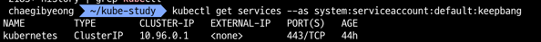
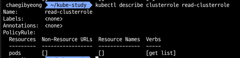
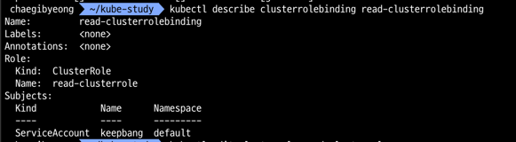

# Kubernetes RBAC-롤바인딩(rolebinding)

- RBAC : Role-Based Access Control
- 역할 기반으로 쿠버네티스 시스템 권한 관리

### 롤바인딩
- 특정 네임스페이스에 대한 권한을 관리 한다.
- ex) 특정 사용자에게 해당 사용자 전용 네임스페이스를 따로 만들어주고 그 네임스페이스만 컨트롤 할 수 있게 계정을 부여함.

-----

### 1. 사용자 생성
- `kubectl create serviceaccount [계정명]`

```
# kubectl create serviceaccount keepbang
```

### 2. 롤 생성
- `Role` 파일 생성 후 `apply`를 통해 적용

[role.yml]
```shell
apiVersion: rbac.authorization.k8s.io/v1
kind: Role
metadata:
  namespace: default
  name: service-reader
rules:
- apiGroups: [""] # 대상이 될 오브젝트 API 그룹, kubectl api-resources
  resources: ["services"] # 대상이 될 오브젝트
  verbs: ["get", "list"] # 허용할 동작
```

```
# kubectl apply -f ./role.yml
```

-----

### 3. 롤 바인딩 생성
- `role`에 사용자를 묶어주는것
- `RoleBinding` 파일 생성 후 `apply`를 통해 적용

[service-reader-rolebinding.yml]
```shell
apiVersion: rbac.authorization.k8s.io/v1
kind: RoleBinding
metadata:
  namespace: default
  name: service-reader-rolebinding
subjects: # 누구에게
- kind: ServiceAccount # 권한 부여 오브젝트
  name: keepbang # 계정 명
  namespace: default
roleRef:  # 어떤 롤을
  kind: Role # Role에
  name: service-reader # service-reader로 명명된 Role 을 부여 하겠다.
  apiGroup: rbac.authorization.k8s.io
```

```
# kubectl apply -f ./service-reader-rolebinding.yml
```

-----

### 4. 서비스 확인

```
# kubectl get services --as system:serviceaccount:default:keepbang
```




-----

#### 과제
- Cluster role 생성해보기


### Cluster role?
- `Role`이 지정된 네임스페이스에 권한을 정의하는 거라면 `Cluster Role`은 속해있지 않은 네임스페이스에서도 권한을 정의하는 것이다.

### 1. 클러스터 롤 생성
- `namespace` 전체에 적용되기 때문에 `namespace`속성이 없다

[read-clusterrole.yml]
```shell
kind: ClusterRole
apiVersion: rbac.authorization.k8s.io/v1
metadata:
  name: read-clusterrole # read-clusterrole 이라는 이름으로 생성
rules:
- apiGroups: [""]
  resources: ["pods"] # 전체 네임스페이스의 pod에 대한 get, list 권한 부여
  verbs: ["get", "list"]
```

```
# kubectl apply -f ./read-clusterrole.yml
```



-----

### 2. 클러스터 롤 바인딩 생성
- `role binding`과 마찬가지로 `cluster role`과 사용자를 묶어주는 것

[read-clusterrolebinding.yml]
```shell
kind: ClusterRoleBinding
apiVersion: rbac.authorization.k8s.io/v1
metadata:
  name: read-clusterrolebinding
subjects:
- kind: ServiceAccount
  name: keepbang
  namespace: default # 서비스어카운트는 네임스페이스에 속해있기 때문에 어떤 네임스페이스에 속한 서비스어카운트인지 명시해야함.
  apiGroup: ""
roleRef:
  kind: ClusterRole
  name: read-clusterrole
  apiGroup: rbac.authorization.k8s.io
```

```
# kubectl apply -f ./read-clusterrolebinding.yml
```

