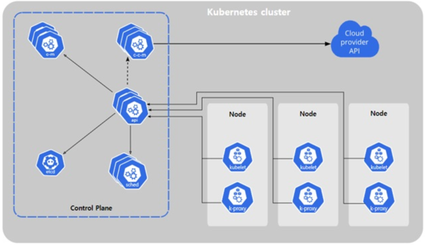
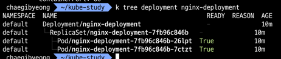

# kubectl
- 쿠버네티스를 사용하기 위한 기본적인 도구 CLI
- 여러가지 작업들을 kubectl을 통해 할 수 잇다.

[리눅스에 kubectl 설치하기](https://kubernetes.io/ko/docs/tasks/tools/install-kubectl-linux/)

# Pod(파드)
- 가장 작고 단순한 쿠버네티스 오브젝트
- container 여러개를 담고있다(1개이상의 컨테이너가 들어간다.)
- 일반적으로 하나의 파드안에 하나의 컨테이너만 관리 한다.
- 서로 다른 파드들은 각각 ip들을 부여받고 같은 네트워크상에 구성되어 통신한다.


- 파드 생성 명령어를 수행하면 kubelet을 통해 노드 안에 파드가 생성된다.

- pod 생성
```
$ cat ./nginx-pod.yaml
apiVersion: v1
kind: Pod
metadata:
  name: my-nginx-pod
spec:
  containers:
    - name: my-nginx-container
      image: nginx:latest
      ports:
        - containerPort: 80
          protocol: TCP
          
$ k apply -f ./nginx-pod.yaml

```


# krew
- 생산성 향상을 위한 도구

```
$ brew update
$ brew install kube-ps1
```

### 플러그인 설치해보기
- https://krew.sigs.k8s.io/plugins/

### [kubectl-tree](https://github.com/ahmetb/kubectl-tree)

- 네임스페이스, 디플로이먼트, 서비스, 인그레스 등 클러스터의 리소스 간의 계층 구조를 보여주는 데 사용

[[nginx-deployment.yaml](https://raw.githubusercontent.com/kubernetes/website/main/content/ko/examples/controllers/nginx-deployment.yaml)]
```
apiVersion: apps/v1
kind: Deployment
metadata:
  name: nginx-deployment
spec:
  selector:
    matchLabels:
      app: nginx
  replicas: 3 # tells deployment to run 2 pods matching the template
  template:
    metadata:
      labels:
        app: nginx
    spec:
      containers:
      - name: nginx
        image: nginx:1.14.2
        ports:
        - containerPort: 80
```


